回顾一下regev笔记中关于格的讲义。
:::note
参考资料 [Lattices in Computer Science (Fall 2009)](https://cims.nyu.edu/~regev/teaching/lattices_fall_2009/)
:::
# what's lattice
格是具有周期结构的n维空间上的点集，比如下面的：
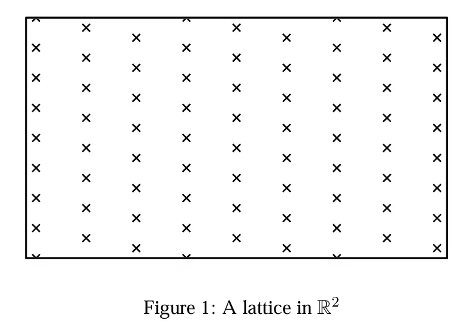
# lattices
**DEFINITION1**:  
给定n个线性无关的向量，而每一向量是m维的，格可以表示为:  
$$
L(b_1,b_2,...,b_n)=\{\sum{x_ib_i|x_i\in Z}\}
$$
把$b_i$看做是格的基，同理也可以用矩阵来表示格:
$$
L(B)=\{\sum{Bx|x\in Z^n}\}
$$
可以说格的阶是n，维度为m。如果n=m，就称为满阶格。
格的基并不唯一，比如说$Z^2$的可以是（为了方便表示，下面所说的向量都是列向量）：
- $(0,1),(1,0)$
- $(1,1),(2,1)$
- $(2025,1),(2006,1)$
生成的格如下：
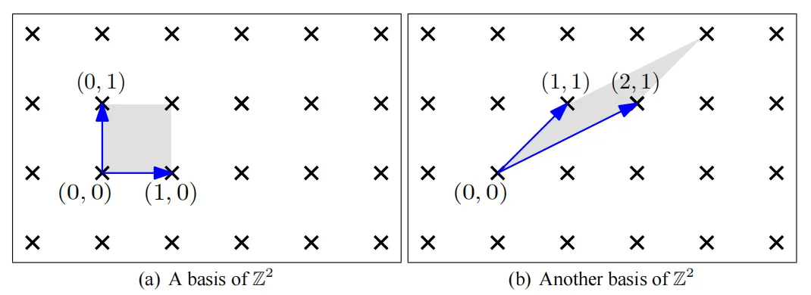
而$(1,1),(2,0)$产生的格就是下面所示的了：
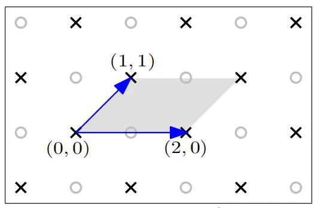  
再来看看$(2,1)$张成的格，这是一个阶为1，二维的格
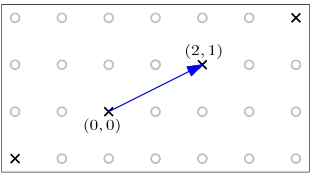  
**DEFINITION2：**  
The span of a lattice $L(B)$ is the linear space spanned by its vectors.  
$$
span(L(B))=span(B)=\{By|y\in R^n\}
$$
:::note
span表示张成的空间
:::
**DEFINITION3：**  
对于任何格基B，有:
$$
P(B)=\{Bx|x\in R^n,\forall i:0 \le x_i < 1\}
$$
这个表示的就是格基张成的空间，为如下所示的灰色区域。可以看到这个P(B)完全取决于格基。如果将P(B)放置在整个格点上，可以看到其平铺了整个格。
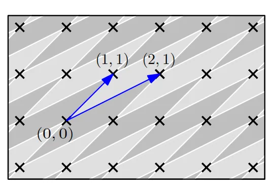
怎么判断给定的向量是否是给点的格中的格基呢，可以用以下的公式来说明。就是说P(B)除了最初的格点，不能包含其余的格点。  
**LEMMA1：**  
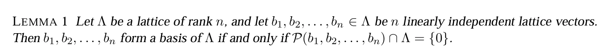
证明如下：
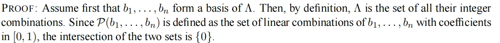
如何判断两个格基形成的格是相等的呢？这需要用到下面的定义：  
**DEFINITION 4：**
$$
A\ matrix\ U\in Z^{n\times n}\ is \ called \ unimodular\ if \ det\ U\ = \pm 1
$$
**LEMMA 4:**
$$
if\ U\ is\ unimodular\ then\ U^{-1}\ is\ also\ unimodular\ 
$$
**LEMMA 5:**
$$
if\ U\ is\ unimodular\ then\ U^{-1}\ is\ also\ unimodular\ 
$$
针对LEMMA5的证明如下：  
证明1：
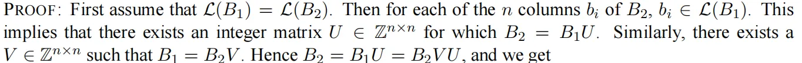
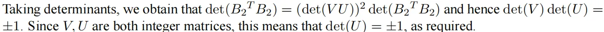
证明2：
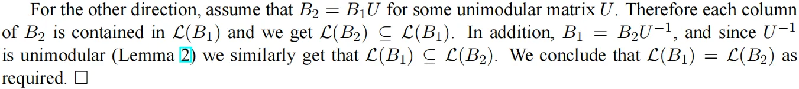
推论：
只有B是unimodular，才是$Z^n$的基。
**LEMMA4：**
基是相等的，当且仅当满足以下的操作：
$$
b_i\leftarrow b_i+kb_j\ for\ some\ k\in Z
$$
$$
b_i \leftrightarrow b_j
$$
$$
b_i\leftarrow -b_i
$$
**DEFINITION 5:**
格的行列式表示为：
$$
det(\wedge):=\sqrt{det(B^TB)}
$$
如果是满阶格，那么有：
$$
det(\wedge)=|det(B)|
$$
# Gram-Schmidt Orthogonalization  
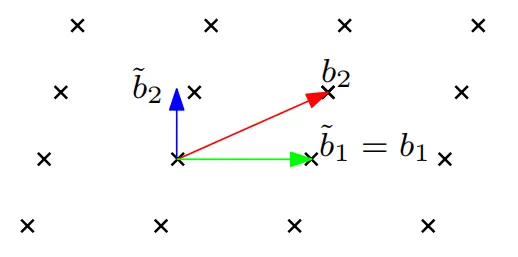
**DEFINITION 6**
Gram-Schmidt Orthogonalization定义为：
$$
\widetilde{b_i}=b_i-\sum_{j}^{i-1}u_{i,j}\widetilde{b_i},where\ u_{i,j}=\frac{<b_i,\widetilde{b_j}>}{<\widetilde{b_j},\widetilde{b_j}>}
$$
首先有：
$$
span(b_1,b_2,...,b_n)=span(\widetilde{b_1},\widetilde{b_2},...,\widetilde{b_n})
$$
但是正交化后的基并不在格中。
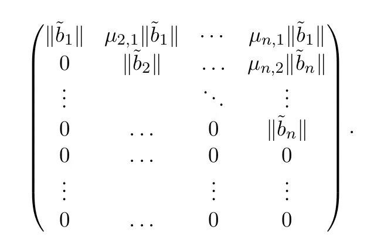
# Successive minima  
格里很重要的就是最短向量的长度
**DEFINITION 7:**
第i个离散最小值定义为：
$$
\overline{B}(0,r)=\{x\in R^m |\  ||x|| \le r\}
$$
$$
\lambda_i(\wedge)=inf\{r|dim(span(\wedge)\cap \overline{B}(0,r))\ge\ r\}
$$
翻译一下定义，就是随着r半径不断扩大，所张成的这个球( 可能有很多维）里包含的格点所组成的向量空间的维数>=i时，即为第i个相继最小值。为什么第2个相继最小值是2.3呢，而不是2呢。因为半径为2时，它所包含的向量在一条线上，只能组成一维，所以不是。而因为整个格点只有二维，所以说也只有两个相继最小值。
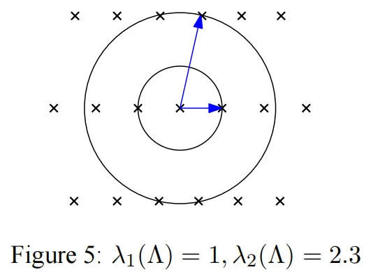
**THEOREM 5：**
$$
\lambda_1(L(B))\ge \min_{i=1,..,n}||\widetilde{b_i}|| >0
$$
证明：
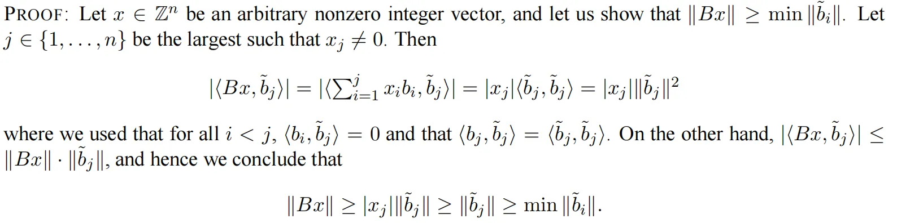
**COROLLARY 6：**
$$
||x-y||>\epsilon, \forall x,y\in \wedge,\epsilon > 0
$$
证明：
$$
||x-y||\ge \lambda_1(\wedge) > 0
$$
**CLAIM 7:**
一定存在向量vi，使得：
$$
||vi||=\lambda_i(\wedge)
$$
## Upper bounds on the successive minima
**THEOREM 8（Blichfeldt's theorem）:**
给定一个集合S，其体积大于格的行列式，那么在S中一定存在两点的差在格中，如下图所示  
证明为：
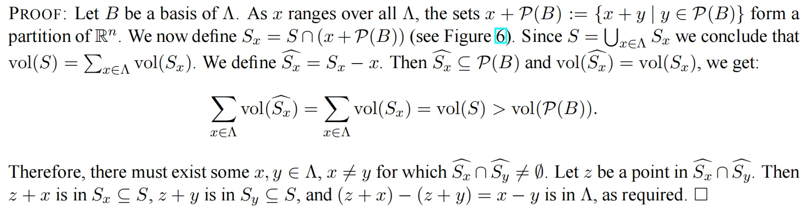
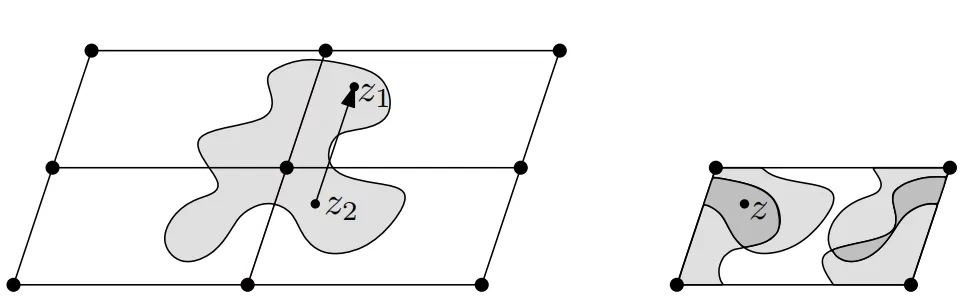
**THEOREM 9（Minkowski's convex body theorem）:**  
对于任意中心对称的凸集S，如果vol(S)>det(A)2^n，那么S中一定包含格点  
证明（特别精彩）：
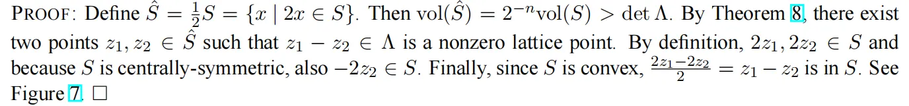
如下所示：
半径为r的n维球的体积为$vol(B(0,r))\ge \frac{2r}{\sqrt{n}}^n$
证明：因为这个球包含了一个立方体长度为$\frac{2r}{\sqrt{n}}^n$，所以有
$$
\{x\in R^n|\forall i,|x_i|<\frac{r}{\sqrt{n}}\} \subseteq B(0,r)
$$
**COROLLARY2  (MINKOWSKI'S FIRST THEOREM):**
对于阶为n的满阶的格都有：
$$
\lambda_1(\wedge)\le \sqrt{n}(det\wedge)^{\frac{1}{n}}
$$
证明：
$$
(\frac{2\lambda_1(\wedge)}{\sqrt n})^n \le vol(B(0,\lambda_1(\wedge))) \le 2^{n} det \wedge
$$
**THEOREM3（MINKOWSKI'S SECOND THEOREM）:**
对于阶为n的满阶的格都有：
$$
(\prod_{i=1}^{n}\lambda_i(\wedge))^{\frac{1}{n}} \le \sqrt n(det\wedge)^{\frac{1}{n}}
$$
# Computational problems
Minkowski的第一定理证明了任何n阶的格包含一个非零向量长度的最大值，即最短向量。然后他并没有给出如何找到这个向量的算法。事实上，确实没有有效的算法能找到这样的最小值。
为了讨论这样的问题，将其定义为the shortest vector problem，SVP。可以将SVP问题分为三类：
- **Search SVP**：给定一个格，找到最小的向量v，使得其$||v||=\lambda_1(L(B))$
- **Optimization SVP**: 给定一个格，找到$\lambda_1(L(B))$
- **Decisional SVP**: 给定一个格和一个有理数r，决定是否$\lambda_1(L(B))\le r$  
三个问题实际上是平等的，不存在谁比谁困难的问题。  
为了简化问题，将SVP转换为找一个大约的最短向量，刚才的SVP问题转换为：  
- **Search SVPy**: $||v||=\gamma\cdot \lambda_1(L(B))$
- **Optimization SVPy**: 找到一个d，使得$d \le \lambda_1(L(B)) \le \gamma \cdot d$
- **Promise SVPy**: 
  - Yes：$\lambda_1(L(B))\le r$
  - No: $\lambda_1(L(B))> \gamma \cdot r$  
另外一个格中难题就是CVP问题，最近向量问题，可以分成：  
- **Search CVPy**: 对于给定的向量t，找到格中的一个向量使得$||v-t||\le \gamma \cdot dist(t, L(B))$
- **Optimization CVPy**: 找到d，使得$d \le dist(t,L(B))\le \gamma \cdot d$
- **Promise CVPy**:
  - Yes: $dist(t,L(B)) \le r$
  - No: $dist(t,L(B)) > \gamma \cdot r$
除了这SVP和CVP外，还有两个容易解决的问题：
- **Membership**: 看是否v在L(B)中，就看Bx=v是否有解
- **Equivalence**: L(B1)和L(B2)是否相等，可以看B1是否在L(B2)中，B2是否在B1中。

