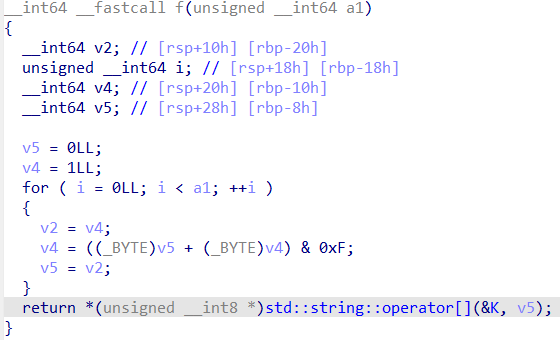
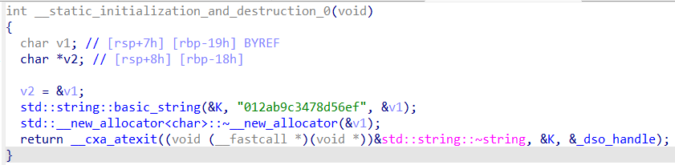

第三年ciscn，ldx来看看题。
# ecdsa
这题好蠢，私钥已经给出来了，直接md5转一下交flag完事。
```python
from hashlib import sha512, md5
from ecdsa import NIST521p
digest_int = int.from_bytes(sha512(b"Welcome to this challenge!").digest(), "big")
curve_order = NIST521p.order
priv_int = digest_int % curve_order
print("flag{"+md5(str(priv_int).encode()).hexdigest()+"}")
# flag{581bdf717b780c3cd8282e5a4d50f3a0}
```
# Ezflag
ida查看，丢给ai分析。告诉f函数实际上是斐波那契数列。  

:::note
斐波那契数列在有限域中具有周期性。
:::
捋一下加密思路，就是生成斐波那契数列，然后模上16，替换成K数组里对应的字符。    
K数组的值由__static_initialization_and_destruction_0函数初始化。  

这题有个注意的点，就是会发生溢出。如果是用python写脚本的话，这个溢出需要模拟才能得到flag。
```python
# 等价于 C++ unsigned __int64
MASK64 = 0xFFFFFFFFFFFFFFFF

# 全局字符串 K（来自静态初始化）
K = "012ab9c3478d56ef"

# f(a1) 的等价实现（已优化）
def f(a1: int) -> str:
    # Fibonacci mod 16 的 Pisano 周期
    a1 %= 24

    prev = 0
    curr = 1

    for _ in range(a1):
        prev, curr = curr, (prev + curr) & 0xF

    return K[prev]


def main():
    v11 = 1  # unsigned __int64
    flag_chars = []

    for v10 in range(32):
        # 生成一个 flag 字符
        flag_chars.append(f(v11))

        # 插入 '-'
        if v10 in (7, 12, 17, 22):
            flag_chars.append('-')

        # v11 = v11 * 8 + (v10 + 64)，模拟 64 位无符号溢出
        v11 = (v11 * 8 + (v10 + 64)) & MASK64

    flag = "flag{" + "".join(flag_chars) + "}"
    print(flag)


if __name__ == "__main__":
    main()
# flag{10632674-1d219-09f29-14769-f60219a24}
```
# RSA_NestingDoll
题目源码：
```python
from Crypto.Util.number import *
from tqdm import tqdm
import os

flag=open("./flag.txt","rb").read()
flag=bytes_to_long(flag+os.urandom(2048//8-len(flag)))
e=65537

def get_smooth_prime(bits, smoothness, max_prime=None):
    assert bits - 2 * smoothness > 0
    p = 2
    if max_prime!=None:
        assert max_prime>smoothness
        p*=max_prime
        
    while p.bit_length() < bits - 2 * smoothness:
        factor = getPrime(smoothness)
        p *= factor

    bitcnt = (bits - p.bit_length()) // 2
    while True:
        prime1 = getPrime(bitcnt)
        prime2 = getPrime(bitcnt)
        tmpp = p * prime1 * prime2
        if tmpp.bit_length() < bits:
            bitcnt += 1
            continue
        if tmpp.bit_length() > bits:
            bitcnt -= 1
            continue
        if isPrime(tmpp + 1):
            p = tmpp + 1
            break
    return p

p1=getPrime(512)
q1=getPrime(512)
r1=getPrime(512)
s1=getPrime(512)
n1=p1*q1*r1*s1
assert n1>flag

p=get_smooth_prime(1024,20,p1)
q=get_smooth_prime(1024,20,q1)
r=get_smooth_prime(1024,20,r1)
s=get_smooth_prime(1024,20,s1)
n=p*q*r*s

print(f"[+] inner RSA modulus = {n1}")
print(f"[+] outer RSA modulus = {n}")
print(f"[+] Ciphertext = {pow(flag,e,n1)}")
```
其实就是Pollard’s p-1分解算法。我的思路就是不断用这个算法，然后减小规模，直到分解完所有素数：
```python
from gmpy2 import gcd
from Crypto.Util.number import *
n1 = ...
n = ...
c = ...

def factor_n(n1, n):
    a = pow(2,n1,n)
    k = 2
    while True:
        a = pow(a, k, n)
        res = int(gcd(a-1, n))
        if res != 1 and res != n:
            return res
            break
        k += 1
        print(k)
p = factor_n(n1, n)
p1 = factor(p-1)[-1][0]
n1 = n1//p1
n = n//p
q = factor_n(n1, n)
q1 = factor(q-1)[-1][0]
n1 = n1//q1
n = n//q
r = factor_n(n1, n)
r1 = factor(r-1)[-1][0]
s = n1//r1
s1 = factor(s-1)[-1][0]

phi = (p1-1)*(q1-1)*(r1-1)*(s1-1)
d = inverse_mod(65537, phi)
print(long_to_bytes(pow(c,d,p1*q1*r1*s1)))
```